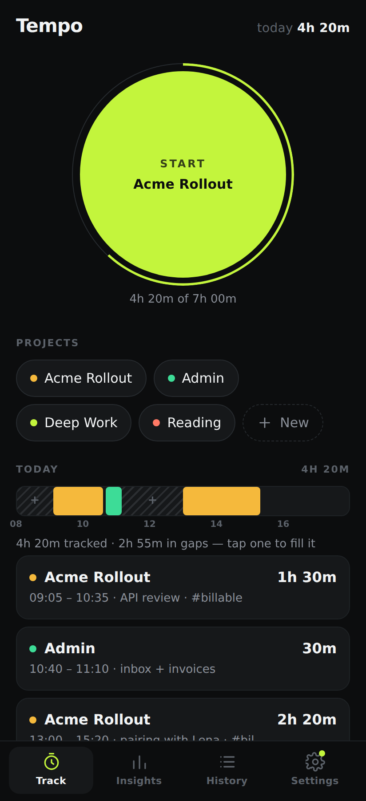
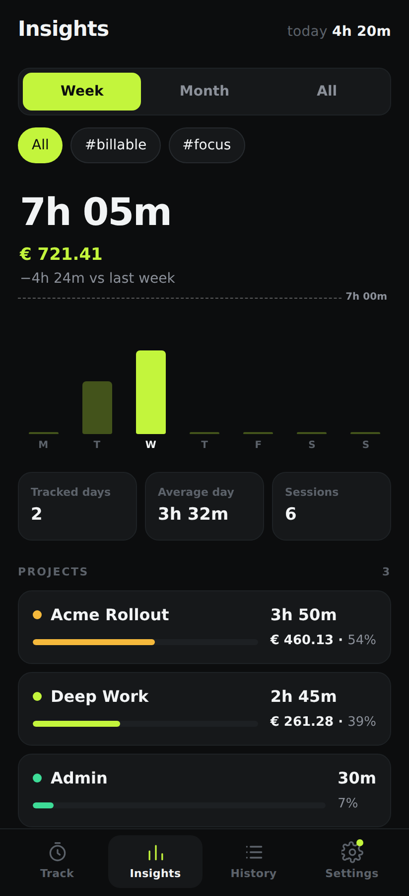
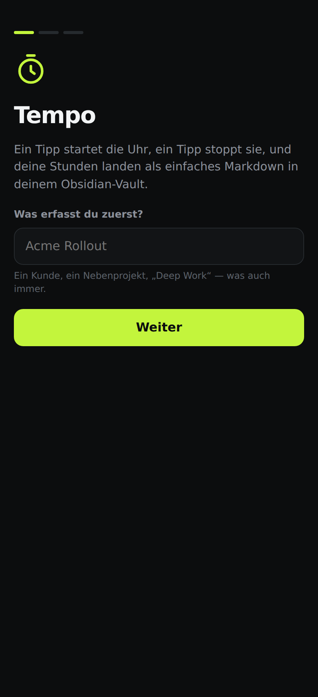
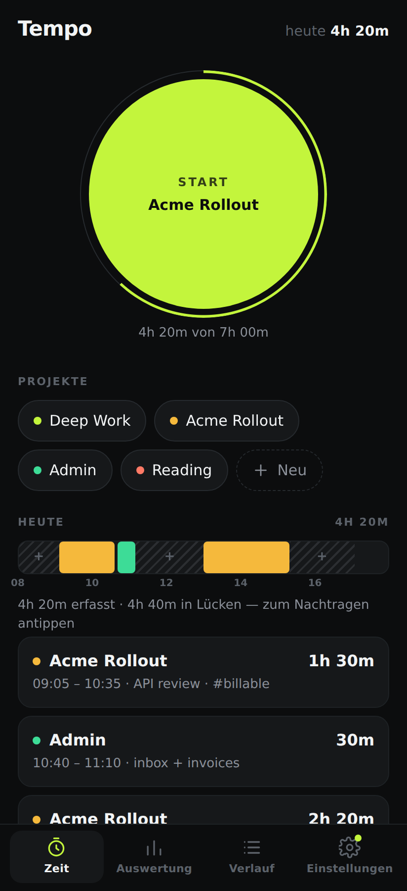

# Tempo

One-tap time tracking for Android that writes straight into your Obsidian vault over WebDAV.

Tap the dial, work, tap it again. Tempo keeps the raw intervals on the phone and pushes a tidy
Markdown block into your daily (or monthly) note — without touching a single line you wrote
yourself.

| Track | Insights | First run | In German |
| --- | --- | --- | --- |
|  |  |  |  |

## What it does

- **One tap to start.** The dial starts the project you used last — no picker, no dialog. Tapping
  a project chip starts that project instead, and tapping a different chip while a timer runs
  switches projects in a single tap.
- **Never lose a session.** The elapsed time is derived from the start timestamp, so it stays
  correct while the app is backgrounded, killed, or the phone restarts.
- **A strip of your day.** Every day shows as a single bar: coloured blocks for what you tracked,
  hatched stretches for what you didn't. Tap a gap and you get an entry already filled in with
  those times — retro-filling a forgotten morning takes one tap and a project name.
- **A daily goal you can read at a glance.** Set one and the ring around the start button fills
  as the day goes on; the chart draws it as a line. With no goal, the ring becomes a second hand
  that sweeps once a minute while a timer runs.
- **Insights.** Week, month or all time: total against the period before it, a bar per day (tap
  one for its figure), tracked days, average day, your current streak and best day, and where the
  hours actually went, per project. Filter the whole screen down to a single tag — `#billable` and
  the chart, the totals and the money all follow. Give a project a weekly target and its bar shows
  progress against it instead of its share.
- **Money, only if you want it.** Give a project an hourly rate and amounts appear in Insights, in
  the CSV and in the note's per-project table. Leave rates empty and Tempo never mentions money.
- **Fix things later.** Every entry can be edited — project, date, start, end, note, tags — or
  added by hand for the meeting you forgot to track. Search history by project, note or tag, and
  pick an old entry back up with **Start this project again**. Deleting anything offers an undo.
  Search, then **Edit all matching entries** to move them to another project or add a tag in one
  go — for cleaning up after a rename or a forgotten tag.
  Forgot to hit start? Nudge a running timer's start by five minutes either way, right on the dial.
  An entry that overlaps another says so once before it saves.
- **A timer left running overnight is caught.** Past the session limit the dial turns amber and
  offers to stop now or to end the session at the limit, instead of quietly inflating the day.
- **Projects can be renamed, priced and pinned** — tap one in Settings. A rename takes every entry
  with it and rewrites the affected notes on the next sync; renaming onto a name that already
  exists merges the two. Pinning holds a project at the front of the chips; the start button still
  repeats whatever you tracked last, so a pin never changes what one tap does.
- **Split and merge entries.** A block that turned out to be two things splits at a time you pick;
  two sessions of the same project merge back into one, keeping both notes and both sets of tags.
  Splitting and merging back leaves exactly what you started with.
- **Obsidian, not another silo.** Sync writes real Markdown to your vault over WebDAV, so the
  data is yours and queryable with Dataview. Optional weekly roll-up notes, **Export CSV** for
  invoicing, and a **JSON backup** kept in the vault so a lost phone is not lost work.
- Each project keeps a colour, derived from its name, so it looks the same on every device, and can
  carry tags it applies automatically — `#billable` on the client work, without remembering.

## The note it writes

For each day (or month) Tempo owns exactly one block, delimited by Obsidian comments that stay
invisible in reading view:

```markdown
%% tempo:begin %%
## ⏱ Time tracking

tracked:: 4h 20m
tracked-hours:: 4.33

| Start | End | Duration | Project | Note |
| --- | --- | --- | --- | --- |
| 09:05 | 10:35 | 1h 30m | Acme Rollout | API review #billable |
| 10:40 | 11:10 | 30m | Admin | inbox + invoices |
| 13:00 | 15:20 | 2h 20m | Acme Rollout | pairing with Lena #billable |

**Per project**

| Project | Duration | Hours |
| --- | --- | --- |
| Acme Rollout | 3h 50m | 3.83 |
| Admin | 30m | 0.50 |

%% tempo:end %%
```

Everything outside the markers is left exactly as you wrote it, so pointing Tempo at your existing
daily notes is safe. If the note does not exist yet it is created with a small front matter block
carrying the tag you configured. `tracked-hours::` is an inline Dataview field, so a vault-wide
report is a three-line query:

```dataview
TABLE tracked-hours AS "Hours"
FROM #time-tracking
SORT file.name DESC
```

Once a project has an hourly rate, the block also carries `billed::` and an **Amount** column in
the per-project table, so the same query can total a month's invoice.

## The ongoing notification (unverified)

On Android a running timer is meant to appear in the notification shade, counting up, with a
quick-settings tile that shows whether anything is running. The Kotlin for it lives in
`src-tauri/android/notification/` and is copied into the generated project by
`scripts/configure-android-notification.mjs`, which CI runs after `tauri android init` — the same
arrangement as the signing config, since `src-tauri/gen/android` is not checked in.

**This is the one part of the app that has never run.** There is no Android SDK in the environment
it was written in and CI has not produced an APK yet, so the Kotlin has not been compiled, let
alone tested on a device. The Rust side is behind `#[cfg(target_os = "android")]` and the desktop
build is unaffected; the notification failing is logged and never touches the timer. Treat the
first real build as the start of debugging this.

Its action opens the app rather than claiming to stop the timer. Stopping from the shade needs the
launch intent plumbed through to the webview, which is the first thing to add once there is a build
to test against.

## First run

The first launch walks through three questions — what you track, your vault, and how notes should
be written — and every step can be skipped. A time tracker that will not let you start tracking has
already failed.

The interface is available in **English and German**; it follows the device language until you pick
one in Settings → Tracking. Messages that come from the backend (sync errors, import results) are
English for now.

## Getting the app onto your phone

### From CI (no toolchain needed)

Push to the repository (or run the **Android APK** workflow by hand) and download the `tempo-apk`
artifact from the run. Without signing secrets it is a debug-signed APK — installable, just enable
"install unknown apps" for your browser or file manager.

> **If a run fails within seconds and has no logs**, GitHub never started the job — that is a
> billing or policy problem, not the workflow. This repository is private, so Actions minutes come
> out of the account quota: check **Settings → Billing → Plans and usage** for an exhausted quota or
> a missing spending limit, or make the repository public (Actions on public repositories are free).
> Building locally, below, needs no Actions at all.

For a proper release build, add these repository secrets and the workflow signs it for you:

| Secret | Value |
| --- | --- |
| `ANDROID_KEYSTORE` | your `.jks` keystore, base64 encoded (`base64 -w0 tempo.jks`) |
| `ANDROID_KEY_ALIAS` | the key alias inside the keystore |
| `ANDROID_KEY_PASSWORD` | the key password |
| `ANDROID_STORE_PASSWORD` | the keystore password |

Create a keystore with:

```bash
keytool -genkey -v -keystore tempo.jks -keyalg RSA -keysize 2048 -validity 10000 -alias tempo
```

Tagging a commit `v0.1.0` also attaches the APK to a GitHub release.

### Locally

Requires Node 22+, Rust, JDK 17, the Android SDK (platform 36, build-tools 36) and NDK r27.

```bash
npm install
export NDK_HOME=$ANDROID_HOME/ndk/27.2.12479018
rustup target add aarch64-linux-android armv7-linux-androideabi i686-linux-android x86_64-linux-android

npm run android:init          # generates src-tauri/gen/android (not checked in)
npm run android:dev           # live reload onto a connected device
npm run android:build         # APK in src-tauri/gen/android/app/build/outputs/apk
```

For a signed release build, drop a `keystore.properties` next to the generated Gradle project and
run `node scripts/configure-signing.mjs` after `android:init` — the same step CI performs.

## Connecting your vault

Settings → **Obsidian via WebDAV**:

| Field | Example |
| --- | --- |
| Server URL | `https://cloud.example.com/remote.php/dav/files/jakob/` (Nextcloud/ownCloud) |
| | `https://your-nas.synology.me:5006/` (Synology WebDAV Server) |
| | `https://webdav.mailbox.org/` (mailbox.org) |
| Username | your account name |
| Password | an **app password** where the provider offers one |
| Folder in the vault | `Vault/Time Tracking` — path relative to the WebDAV root, created if missing |

Hit **Test** to verify the URL and credentials before saving. **Sync now** pushes every day that
changed since the last sync; **Rewrite all** regenerates every note Tempo has ever produced (useful
after changing rounding or the note layout).

The phone is the source of truth: sync only ever writes, so editing the generated block inside
Obsidian will be overwritten on the next push. Anything outside the block is never touched.

### Options

- **One note per day / month** — `2026-09-08.md` or `2026-09.md`.
- **Note path** — a pattern like `Daily/{YYYY}/{YYYY-MM-DD}.md`, relative to the WebDAV root, so
  Tempo writes into the daily notes your vault already has instead of its own folder. Placeholders:
  `{YYYY} {MM} {DD} {YYYY-MM-DD} {YYYY-MM} {MMM} {MMMM} {YYYY-Www} {ww}`. Leave it empty to keep
  everything in the folder above. The weekly roll-up takes its own pattern.
- **Split at midnight** — a session running 23:00–01:00 is stored as two entries, so each day's
  total is its own. On by default.
- **Round durations** — 5/6/10/15/30 minutes, applied to the synced note and the CSV only. Your raw
  times stay exact, so you can always undo it.
- **Daily goal** — draws today's progress around the start button and a line across the chart.
- **Currency symbol** — whatever prefixes an amount. Rates themselves live on each project.
- **Warn about a long session** — after 4–12 hours (or never), a running timer is flagged as
  probably forgotten.
- **Weekly summary note** — additionally writes `Weekly/2026-W37.md`, one section per day plus the
  week's per-project totals. A week is rewritten whole, so it never drifts from the daily notes.
- **Link projects** — writes `[[Acme Rollout]]` instead of plain text, so the vault grows a note
  per project and the graph connects your hours to your work.
- **Sync when a timer stops** — on by default; a sync that failed while offline is retried the next
  time the app comes to the foreground. Turn it off to sync by hand.

### Importing

Drop a `tempo-import.csv` next to your notes and press **Import CSV**. Columns are found by their
header name — `date`, `start` and `end` are required, `project`, `note` and `tags` are used when
present, anything else is ignored — so an export from another tracker usually works after renaming
a couple of headers. Rows that cannot be read are skipped and counted rather than failing the whole
file, and importing the same file twice adds nothing the second time.

### The invoice note

In the month view of Insights, **Write the invoice note** puts `Invoices/2026-09.md` in the vault:
hours, rate and amount per project, a total, and a breakdown per tag, with `billable::` and
`days-worked::` as inline fields. It is the note an invoice gets written from.

### A note per project

Turn on **A note per project** and each project gets its own note — `Projects/Acme Rollout.md` by
default, or a `{project}` pattern of your own. It carries the project's total, its rate and what it
has billed, and a row per day linking back to that day's note. Combined with **Link projects**, the
vault ends up with a graph that connects hours to work.

### Two devices

**Two-way sync** reads `tempo-backup.json` before writing, so a second device's sessions — and its
deletions — arrive here. Deletions travel as tombstones, which is what stops a stale backup from
resurrecting an entry you removed; they are dropped after 120 days, by which time every device has
seen them. Leave it off if you only track on one device: the sync then only ever writes.

### Backup and restore

With **Back up on every sync** left on, each sync also refreshes `tempo-backup.json` in the vault
folder: every entry and project, and deliberately no credentials. **Restore** merges that file back
into the device — entries it does not have are added, nothing already there is overwritten — so it
repairs both a lost phone and a mistaken delete, and running it twice is harmless.

### Exporting

**Export CSV to the vault** writes `tempo-export.csv` beside the notes — one row per entry
(`date,start,end,hours,project,note,tags,rate,amount`), oldest first, regenerated whenever you
press it. `rate` and `amount` are `0.00` for a project without a rate, so the columns never move
around between exports. That is the file a spreadsheet or an invoicing tool wants; the Markdown
notes are for reading.

## Where your data lives

Everything is a single JSON document in the app's private storage
(`/data/data/com.jakobgabriel.tempo/files/tempo.json`), written atomically so a crash can't truncate
your history. Nothing leaves the device until you configure WebDAV, and even then only the note
block is uploaded.

The WebDAV password is stored in that same private file in plain text — readable by the app and by
anyone with root on the device, but not by other apps. Use an app password rather than your main
account password.

## Development

```bash
npm install
npm run dev             # frontend only, in a browser
npm run tauri dev       # desktop shell (Linux needs libwebkit2gtk-4.1-dev)
npm run build           # typecheck + production bundle
npm test                # calendar arithmetic, buckets, project totals

cd src-tauri
cargo test              # store, markdown, CSV, backup, sync planning, time handling
cargo clippy --all-targets -- -D warnings
```

The two WebDAV integration tests are `#[ignore]`d because they need a real server. Any WebDAV
server works — for example:

```bash
pip install wsgidav cheroot
wsgidav --host 127.0.0.1 --port 8099 --root /tmp/dav-root --auth anonymous &

cd src-tauri
TEMPO_DAV_URL=http://127.0.0.1:8099/ cargo test --test webdav_roundtrip -- --ignored
```

They cover the part that is easy to get wrong: creating the folder, creating the note, and
re-syncing a day without disturbing the prose around the generated block.

### How it fits together

```
src/                     React UI — four screens, no router, no state library
  lib/time.ts            timestamps, durations, day and week grouping
  lib/stats.ts           calendar arithmetic, chart buckets, totals, the day strip
  lib/colors.ts          the colour a project gets, derived from its name
  lib/money.ts           rates, amounts and how they are written
src-tauri/src/
  lib.rs                 Tauri commands; every mutation returns a full snapshot
  store.rs               the JSON document and the rules around it
  time.rs                parsing and formatting on the Rust side
  markdown.rs            note rendering and the managed-block splice
  csv.rs                 the export and the import
  backup.rs              the JSON backup written into the vault
  sync.rs                which days end up in which note
  webdav.rs              PROPFIND / MKCOL / GET / PUT
```

Timestamps are stored as RFC 3339 **with the device's UTC offset** (`2026-09-08T09:00:00+02:00`).
That makes "which day was this?" a string operation on both sides — no timezone database on
Android, and a session started in Berlin still belongs to the day you experienced it in.
