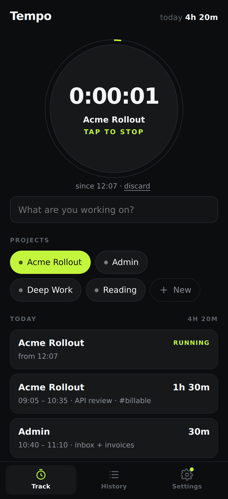
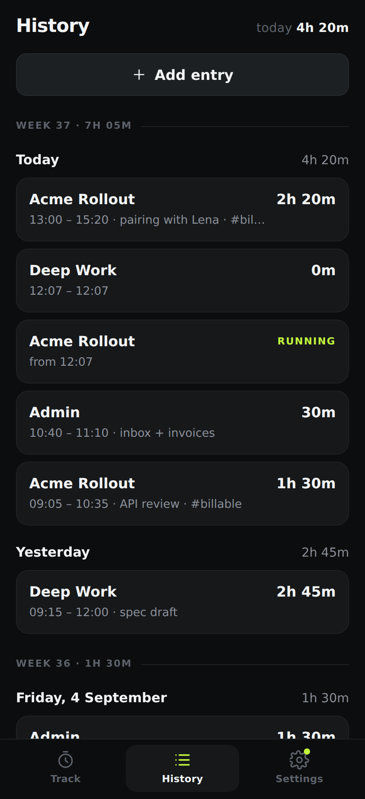
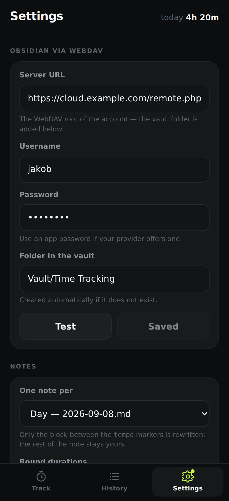

# Tempo

One-tap time tracking for Android that writes straight into your Obsidian vault over WebDAV.

Tap the dial, work, tap it again. Tempo keeps the raw intervals on the phone and pushes a tidy
Markdown block into your daily (or monthly) note — without touching a single line you wrote
yourself.

| Track | Running | History | Settings |
| --- | --- | --- | --- |
|  |  |  |  |

## What it does

- **One tap to start.** The dial starts the project you used last — no picker, no dialog. Tapping
  a project chip starts that project instead, and tapping a different chip while a timer runs
  switches projects in a single tap.
- **Never lose a session.** The elapsed time is derived from the start timestamp, so it stays
  correct while the app is backgrounded, killed, or the phone restarts.
- **Fix things later.** Every entry can be edited — project, date, start, end, note, tags — or
  added by hand for the meeting you forgot to track.
- **Obsidian, not another silo.** Sync writes real Markdown to your vault over WebDAV, so the
  data is yours and queryable with Dataview.

## The note it writes

For each day (or month) Tempo owns exactly one block, delimited by Obsidian comments that stay
invisible in reading view:

```markdown
%% tempo:begin %%
## ⏱ Time tracking

tracked:: 4h 20m
tracked-hours:: 4.33

| Start | End | Duration | Project | Note |
| --- | --- | --- | --- | --- |
| 09:05 | 10:35 | 1h 30m | Acme Rollout | API review #billable |
| 10:40 | 11:10 | 30m | Admin | inbox + invoices |
| 13:00 | 15:20 | 2h 20m | Acme Rollout | pairing with Lena #billable |

**Per project**

| Project | Duration | Hours |
| --- | --- | --- |
| Acme Rollout | 3h 50m | 3.83 |
| Admin | 30m | 0.50 |

%% tempo:end %%
```

Everything outside the markers is left exactly as you wrote it, so pointing Tempo at your existing
daily notes is safe. If the note does not exist yet it is created with a small front matter block
carrying the tag you configured. `tracked-hours::` is an inline Dataview field, so a vault-wide
report is a three-line query:

```dataview
TABLE tracked-hours AS "Hours"
FROM #time-tracking
SORT file.name DESC
```

## Getting the app onto your phone

### From CI (no toolchain needed)

Push to the repository (or run the **Android APK** workflow by hand) and download the `tempo-apk`
artifact from the run. Without signing secrets it is a debug-signed APK — installable, just enable
"install unknown apps" for your browser or file manager.

> **If a run fails within seconds and has no logs**, GitHub never started the job — that is a
> billing or policy problem, not the workflow. This repository is private, so Actions minutes come
> out of the account quota: check **Settings → Billing → Plans and usage** for an exhausted quota or
> a missing spending limit, or make the repository public (Actions on public repositories are free).
> Building locally, below, needs no Actions at all.

For a proper release build, add these repository secrets and the workflow signs it for you:

| Secret | Value |
| --- | --- |
| `ANDROID_KEYSTORE` | your `.jks` keystore, base64 encoded (`base64 -w0 tempo.jks`) |
| `ANDROID_KEY_ALIAS` | the key alias inside the keystore |
| `ANDROID_KEY_PASSWORD` | the key password |
| `ANDROID_STORE_PASSWORD` | the keystore password |

Create a keystore with:

```bash
keytool -genkey -v -keystore tempo.jks -keyalg RSA -keysize 2048 -validity 10000 -alias tempo
```

Tagging a commit `v0.1.0` also attaches the APK to a GitHub release.

### Locally

Requires Node 22+, Rust, JDK 17, the Android SDK (platform 36, build-tools 36) and NDK r27.

```bash
npm install
export NDK_HOME=$ANDROID_HOME/ndk/27.2.12479018
rustup target add aarch64-linux-android armv7-linux-androideabi i686-linux-android x86_64-linux-android

npm run android:init          # generates src-tauri/gen/android (not checked in)
npm run android:dev           # live reload onto a connected device
npm run android:build         # APK in src-tauri/gen/android/app/build/outputs/apk
```

For a signed release build, drop a `keystore.properties` next to the generated Gradle project and
run `node scripts/configure-signing.mjs` after `android:init` — the same step CI performs.

## Connecting your vault

Settings → **Obsidian via WebDAV**:

| Field | Example |
| --- | --- |
| Server URL | `https://cloud.example.com/remote.php/dav/files/jakob/` (Nextcloud/ownCloud) |
| | `https://your-nas.synology.me:5006/` (Synology WebDAV Server) |
| | `https://webdav.mailbox.org/` (mailbox.org) |
| Username | your account name |
| Password | an **app password** where the provider offers one |
| Folder in the vault | `Vault/Time Tracking` — path relative to the WebDAV root, created if missing |

Hit **Test** to verify the URL and credentials before saving. **Sync now** pushes every day that
changed since the last sync; **Rewrite all** regenerates every note Tempo has ever produced (useful
after changing rounding or the note layout).

The phone is the source of truth: sync only ever writes, so editing the generated block inside
Obsidian will be overwritten on the next push. Anything outside the block is never touched.

### Options

- **One note per day / month** — `2026-09-08.md` or `2026-09.md`.
- **Round durations** — 5/6/10/15/30 minutes, applied to the synced note only. Your raw times stay
  exact, so you can always undo it.
- **Sync when a timer stops** — on by default; turn it off to sync manually.

## Where your data lives

Everything is a single JSON document in the app's private storage
(`/data/data/com.jakobgabriel.tempo/files/tempo.json`), written atomically so a crash can't truncate
your history. Nothing leaves the device until you configure WebDAV, and even then only the note
block is uploaded.

The WebDAV password is stored in that same private file in plain text — readable by the app and by
anyone with root on the device, but not by other apps. Use an app password rather than your main
account password.

## Development

```bash
npm install
npm run dev             # frontend only, in a browser
npm run tauri dev       # desktop shell (Linux needs libwebkit2gtk-4.1-dev)
npm run build           # typecheck + production bundle

cd src-tauri
cargo test              # store, markdown, sync planning and time handling
cargo clippy --all-targets -- -D warnings
```

The two WebDAV integration tests are `#[ignore]`d because they need a real server. Any WebDAV
server works — for example:

```bash
pip install wsgidav cheroot
wsgidav --host 127.0.0.1 --port 8099 --root /tmp/dav-root --auth anonymous &

cd src-tauri
TEMPO_DAV_URL=http://127.0.0.1:8099/ cargo test --test webdav_roundtrip -- --ignored
```

They cover the part that is easy to get wrong: creating the folder, creating the note, and
re-syncing a day without disturbing the prose around the generated block.

### How it fits together

```
src/                     React UI — three screens, no router, no state library
  lib/time.ts            timestamps, durations, day and week grouping
src-tauri/src/
  lib.rs                 Tauri commands; every mutation returns a full snapshot
  store.rs               the JSON document and the rules around it
  time.rs                parsing and formatting on the Rust side
  markdown.rs            note rendering and the managed-block splice
  sync.rs                which days end up in which note
  webdav.rs              PROPFIND / MKCOL / GET / PUT
```

Timestamps are stored as RFC 3339 **with the device's UTC offset** (`2026-09-08T09:00:00+02:00`).
That makes "which day was this?" a string operation on both sides — no timezone database on
Android, and a session started in Berlin still belongs to the day you experienced it in.
